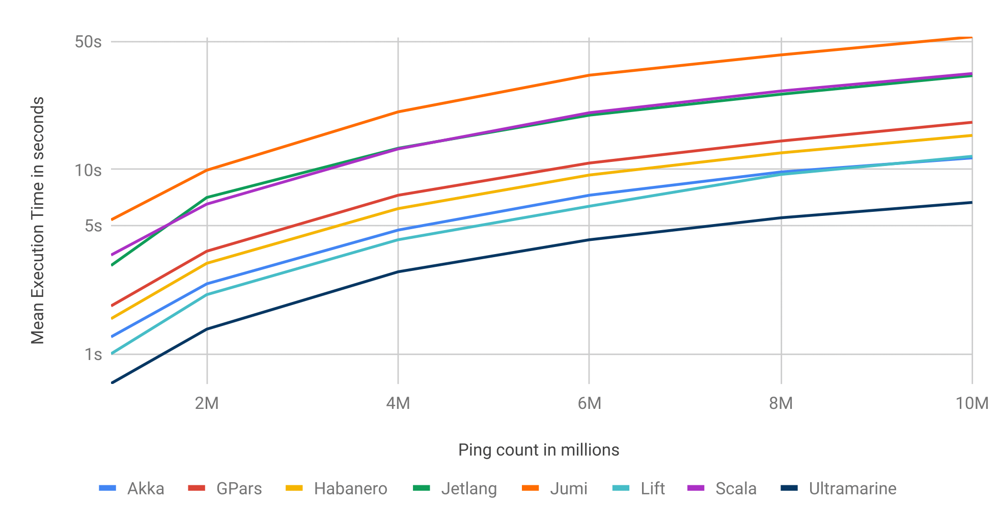
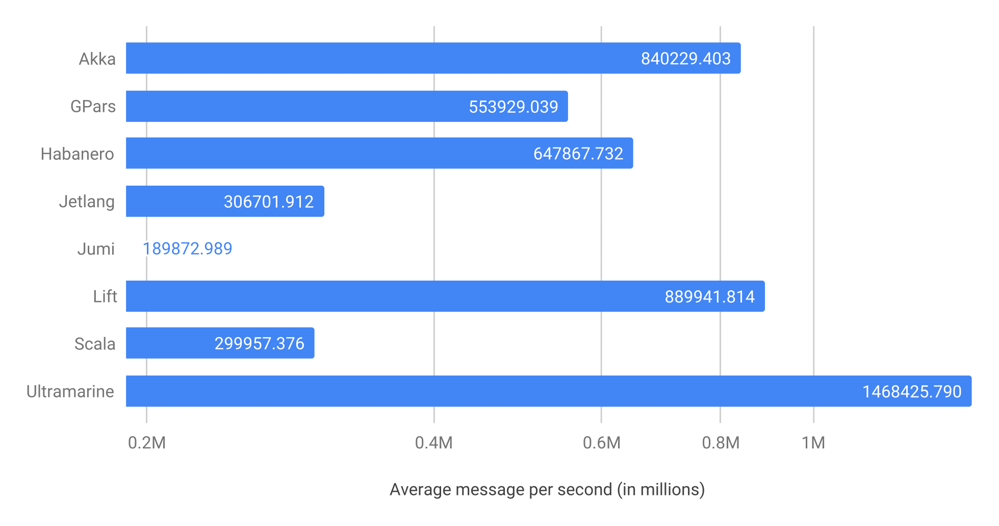
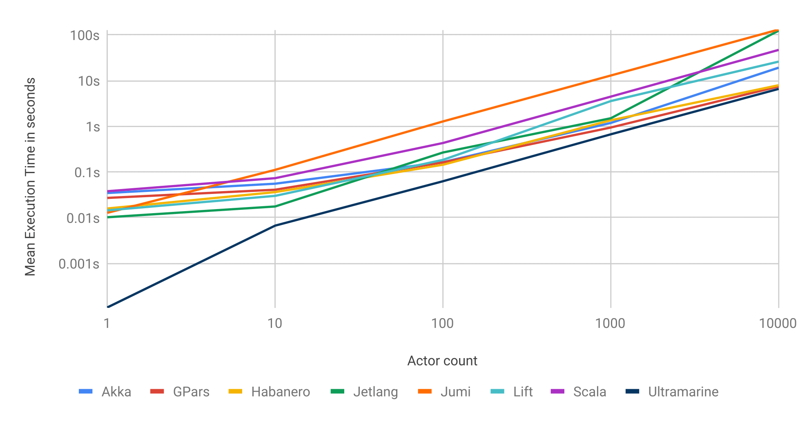
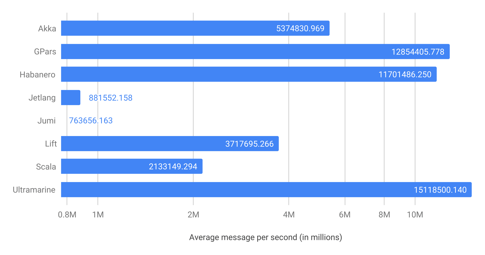
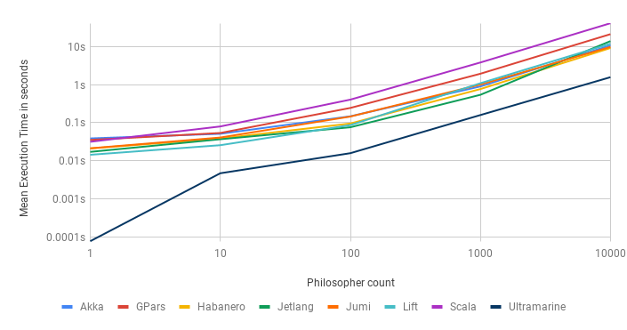
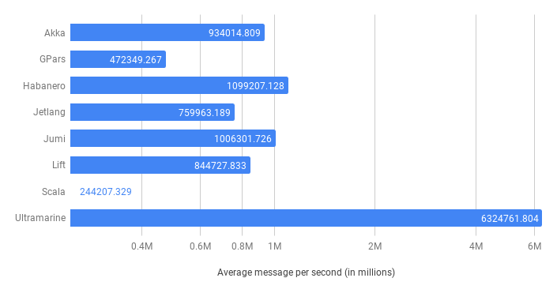
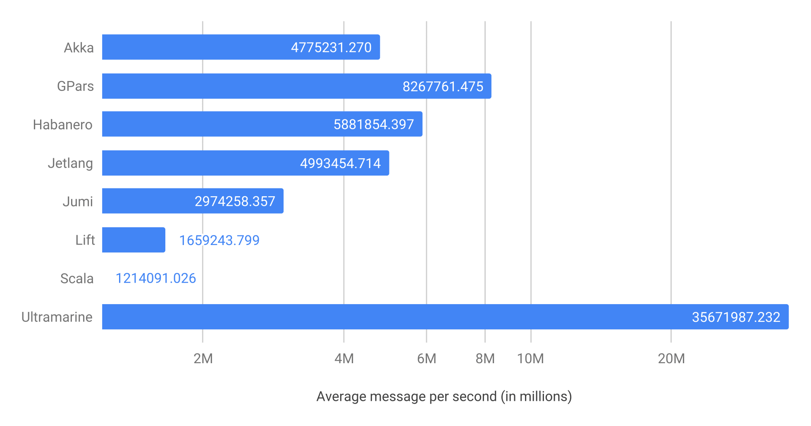

# Benchmarks

For comparison, several actor system libraries/frameworks were tested and compared on a server running Linux Fedora (Linux version `5.0.7-200.fc29.x86_64`), with an Intel i5-8600K (6) @ 4.300GHz. We use [Savina](https://github.com/shamsimam/savina), an open-source actor benchmark suite by @shamsimam for benchmarking reference. Ultramarine is compiled with gcc 8.3.1 in Release mode.
We use several benchmarks to evaluate different aspects of performance. Description and purpose of each benchmark can be found [here](https://shamsimam.github.io/papers/2014-agere-savina.pdf).

## [Ping-Pong](https://github.com/HippoBaro/ultramarine/blob/master/benchmarks/ping_pong.cpp) (one-to-one)

Mean Execution Time | Messages Per Second
---------------------------|--------------------
 | 

## [Fork-Join Throughput](https://github.com/HippoBaro/ultramarine/blob/master/benchmarks/fork-join_throughput.cpp) (one-to-many)

Mean Execution Time | Messages Per Second
---------------------------|--------------------
 | 

## [Dinning philosophers](https://github.com/HippoBaro/ultramarine/blob/master/benchmarks/philosophers.cpp) (many-to-one)

Mean Execution Time | Messages Per Second
---------------------------|--------------------
 | 

## [Big](https://github.com/HippoBaro/ultramarine/blob/master/benchmarks/big.cpp) (many-to-many)

Mean Execution Time | Messages Per Second
---------------------------|--------------------
 | 