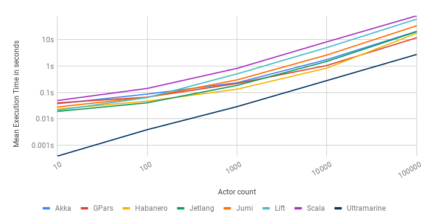
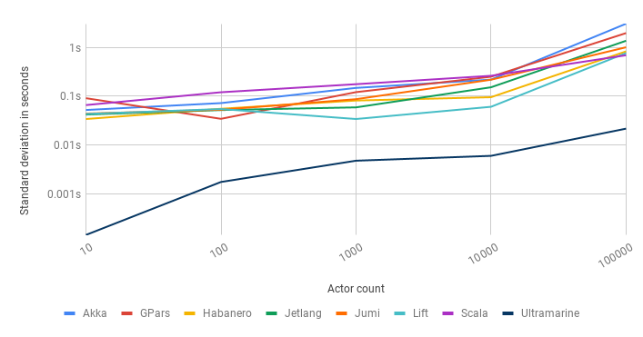

# Ultramarine

[](https://circleci.com/gh/HippoBaro/ultramarine)
[](https://github.com/HippoBaro/ultramarine/blob/master/LICENSE)
[](https://github.com/HippoBaro/ultramarine/releases)

## Introduction

Ultramarine is a lightweight modern actor library built on top of the [Seastar C++ framework](https://github.com/scylladb/seastar). It helps writing distributed applications using virtual actors. It allows developers to write highly scalable applications while greatly simplifying discovery, state management, actor lifetime and more.

The [Virtual Actor Model](http://research.microsoft.com/apps/pubs/default.aspx?id=210931) is an extension of the [Actor Model](https://en.wikipedia.org/wiki/Actor_model) where "virtual" actors (transcendental entities combining state and execution context) share and process information by exchanging messages. 

It is heavily inspired by the [Microsoft Orleans](https://dotnet.github.io/orleans/Documentation/index.html) project.

> Ultramarine is a work-in-progress.

### Installation

Ultramarine is built upon [Seastar](https://github.com/scylladb/seastar) and share the same dependencies. Seastar provides a convenience script to pull all necessary packages (`install-dependencies.sh`).

To pull Seastar and configure Ultramarine:

```
./cooking.sh -t Release
```

To build the examples:

```
ninja -C build
```

### Documentation

Various guides, examples and API reference are [available here](https://hippobaro.github.io/ultramarine/).

### Code Example

First we need to define an [`actor`](api/doc_ultramarine__actor.md#standardese-ultramarine__actor):

```cpp
class hello_actor : public ultramarine::actor<hello_actor> {
public:
    using KeyType = std::string;

    seastar::future<> say_hello() const {
        seastar::print("Hello, %s.\n", key);
        return seastar::make_ready_future();
    }

    ULTRAMARINE_DEFINE_ACTOR(hello_actor, (say_hello));
};
```

And then call the actor activation from anywhere in your seastar code using an [actor_ref](api/doc_ultramarine__actor_ref.md#standardese-ultramarine__actor_ref-Actor-):

```cpp
auto ref = ultramarine::get<hello_actor>("Ultramarine");
auto future = ref.tell(hello_actor::message::say_hello());
// wait or attach a continuation to the returned future.
```

### Performance

Ultramarine is build on Seastar and benefits from a lock-free, [shared-nothing design](http://seastar.io/shared-nothing/). Compared to typical actor model implementation, it doesn't use any locking or complex cache-unfriendly concurrent data-structures internally.

Specifically, this gives Ultramarine an advantage on many-to-many communication patterns, because there is not contention on mailboxes. Also, because Ultramarine doesn't have per-actor mailboxes and thus doesn't process actor's message in batches, it has better latency characteristics.

As an example see how it compares against other popular actor libraries on the [Big actor benchmark](http://release.softlab.ntua.gr/bencherl/files/erlang01-aronis.pdf):

Mean Execution Time        | Standard deviation
---------------------------|--------------------
    | 

More information and benchmarks are [available here](benchmarks.md).

### License

This project is licensed under the [MIT license](https://github.com/HippoBaro/ultramarine/blob/master/LICENSE).


